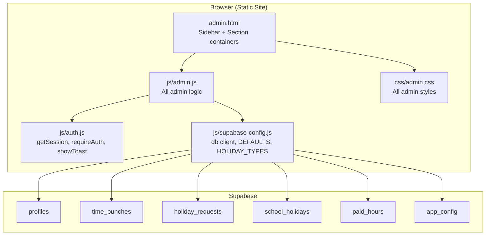
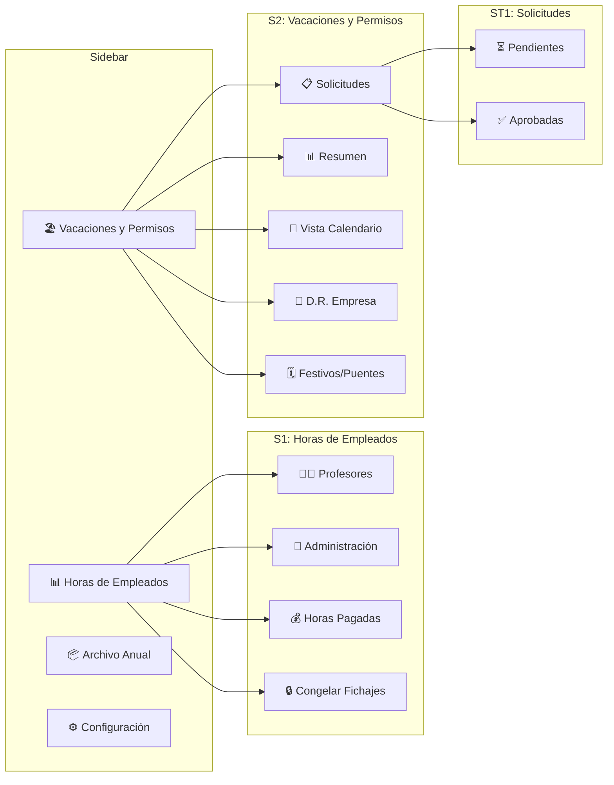
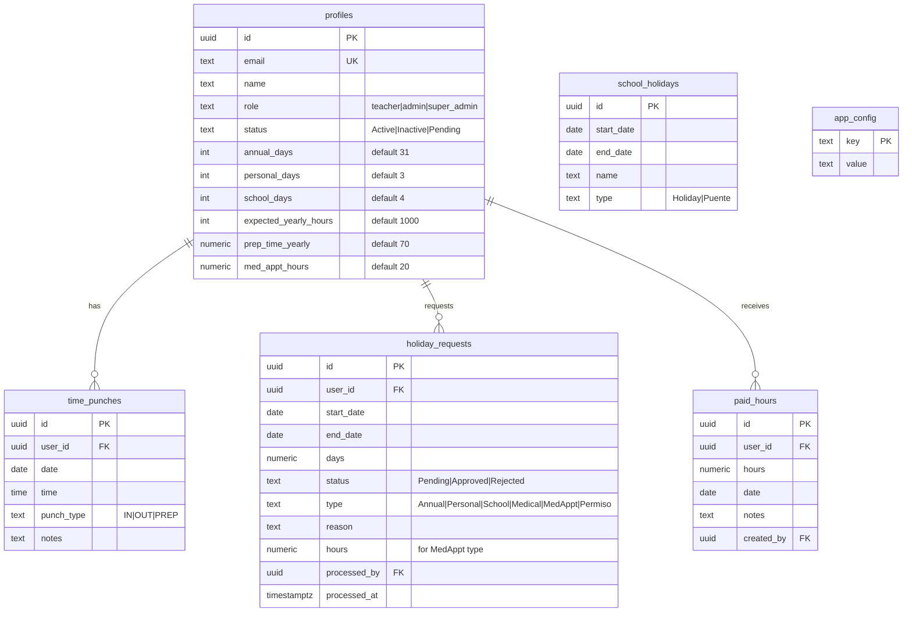

# Design Document: Admin Panel Rebuild

## Overview

This design covers the 1:1 rebuild of the admin panel from the original `AdminPunch.html` + `Code.js` (Google Apps Script) to a static-site Supabase-backed application. The target files are `admin.html`, `js/admin.js`, and `css/admin.css`. The app uses vanilla JS with no frameworks or build tools, loads the Supabase JS client from CDN, and references it as `db` from `js/supabase-config.js`.

The admin panel is a single-page application with:
- A fixed sidebar with 4 main navigation sections
- Tabbed and sub-tabbed content areas within sections
- Modal dialogs for editing, creating, and confirming actions
- Real-time stats grids with progress calculations
- Monthly/weekly view toggling with date navigation

All data comes from 6 Supabase tables: `profiles`, `time_punches`, `holiday_requests`, `school_holidays`, `paid_hours`, `app_config`.

## Architecture



The architecture is intentionally flat — a single JS file (`admin.js`) contains all admin logic organized into clearly commented sections. This matches the original monolithic approach and avoids build tooling.

### Navigation Hierarchy



## Components and Interfaces

### 1. HTML Structure (`admin.html`)

The HTML is organized as a single page with hidden/shown sections:

```
body
├── .mobile-menu-btn          (hamburger, visible ≤768px)
├── .sidebar#sidebar
│   ├── .sidebar-header       (🕐 logo, "Control de Fichaje", subtitle)
│   ├── .sidebar-nav
│   │   ├── .nav-item[data-section="hours"]      "📊 Horas de Empleados"
│   │   ├── .nav-item[data-section="holidays"]    "🏖️ Vacaciones y Permisos" + badge
│   │   ├── .nav-item[data-section="archive"]     "📦 Archivo Anual"
│   │   └── .nav-item[data-section="settings"]    "⚙️ Configuración"
│   └── .sidebar-footer       (admin info card, sign-out button)
├── .main-content
│   ├── #section-hours.content-section.active
│   │   ├── .page-header      (title + Export/Refresh buttons)
│   │   ├── #hoursStatsGrid.stats-grid  (5 stat cards)
│   │   ├── .tab-bar          (Profesores | Administración | Horas Pagadas | Congelar)
│   │   ├── #tab-teachers.tab-content.active
│   │   │   ├── .card-header  (title, add btn, search, view toggle, month/week nav)
│   │   │   └── table         (teacher hours table)
│   │   ├── #tab-admin.tab-content
│   │   │   ├── .card-header  (title, add btn, search, view toggle, month/week nav)
│   │   │   └── table         (admin hours table)
│   │   ├── #tab-paid.tab-content
│   │   │   └── .two-col-grid (form card + history card)
│   │   └── #tab-freeze.tab-content
│   │       └── .two-col-grid (freeze control + info card)
│   ├── #section-holidays.content-section
│   │   ├── .page-header
│   │   ├── #holidayStatsGrid.stats-grid (4 stat cards)
│   │   ├── .sub-tab-bar.pill-tabs (Solicitudes | Resumen | Calendario | D.R. Empresa | Festivos)
│   │   ├── #subtab-requests.subtab-content.active
│   │   │   ├── .inner-tab-bar (Pendientes | Aprobadas)
│   │   │   ├── #inner-pending.inner-tab-content.active
│   │   │   └── #inner-approved.inner-tab-content
│   │   ├── #subtab-summary.subtab-content
│   │   ├── #subtab-calendar.subtab-content
│   │   ├── #subtab-drempresa.subtab-content
│   │   └── #subtab-festivos.subtab-content
│   ├── #section-archive.content-section
│   └── #section-settings.content-section
└── #modalOverlay.modal-overlay
    └── .modal
        ├── .modal-header     (gradient, title, close btn)
        └── .modal-body#modalBody (dynamic content)
```

### 2. JavaScript Module Organization (`js/admin.js`)

The JS file is organized into clearly separated sections using comment banners:

```javascript
// ========================================
// STATE
// ========================================
let adminProfile = null;
let allTeachers = [];        // cached teacher profiles
let allAdminWorkers = [];    // cached admin profiles
let currentSection = 'hours';
let currentTab = 'teachers';
let currentSubTab = 'requests';
let currentInnerTab = 'pending';
let viewMode = 'monthly';    // 'monthly' | 'weekly'
let monthOffset = 0;         // 0 = current month, -1 = last month, etc.
let weekOffset = 0;          // 0 = current week, -1 = last week, etc.
let calendarMonth = null;    // for holiday calendar sub-tab
let calendarYear = null;

// ========================================
// INIT
// ========================================
// initAdmin() — requireAuth, populate sidebar footer, loadSection

// ========================================
// NAVIGATION
// ========================================
// showSection(section) — toggle .content-section, load data
// showTab(tab) — toggle .tab-content within hours section
// showSubTab(subtab) — toggle .subtab-content within holidays section
// showInnerTab(innertab) — toggle .inner-tab-content within solicitudes

// ========================================
// HOURS SECTION — STATS
// ========================================
// loadHoursStats() — query profiles, punches, holidays, compute stats grid

// ========================================
// HOURS SECTION — TEACHERS TAB
// ========================================
// loadTeachersTable() — build teacher rows with hours, progress, prep time
// renderTeacherRow(teacher) — single row HTML
// filterTeachers() — search filter

// ========================================
// HOURS SECTION — ADMIN TAB
// ========================================
// loadAdminTable() — build admin worker rows (no prep time column)
// renderAdminRow(admin) — single row HTML
// filterAdmins() — search filter

// ========================================
// HOURS CALCULATION ENGINE
// ========================================
// calculateHoursFromPunches(punches, startDate, endDate)
// buildSchoolHolidayDateSet(holidays)
// precomputeWorkingDays(year, asOfDate, schoolHolidayDates)
// getEmployeeWorkingDayProgress(baseWorkingDays, holidayDates, allocatedDays)
// buildEmployeeHolidayDates(requests, year)
// countMedicalWorkingDaysInRange(medDates, baseWorkingDays, start, end)
// getMedApptHoursInRange(requests, start, end)

// ========================================
// VIEW MODE & NAVIGATION
// ========================================
// setViewMode(mode) — toggle monthly/weekly, reload tables
// navigateMonth(direction) — monthOffset += direction, reload
// navigateWeek(direction) — weekOffset += direction, reload
// getMonthRange(offset) — returns {start, end, label, isCurrent}
// getWeekRange(offset) — returns {start, end, label, weekNumber, isCurrent}

// ========================================
// TEACHER CALENDAR MODAL
// ========================================
// openTeacherCalendar(userId) — fetch punches, render calendar grid
// renderCalendarGrid(punches, year, month)
// showDayDetail(userId, dateStr, punches)

// ========================================
// SUPER ADMIN PUNCH EDIT
// ========================================
// addPunch(userId, dateStr, time, type)
// editPunch(punchId, newTime)
// deletePunch(punchId)

// ========================================
// EDIT TEACHER / ADMIN SETTINGS MODALS
// ========================================
// openEditTeacherModal(userId)
// saveTeacherSettings(userId)
// openEditAdminModal(userId)
// saveAdminSettings(userId)

// ========================================
// ADD TEACHER / ADMIN MODALS
// ========================================
// openAddTeacherModal()
// submitNewTeacher()
// openAddAdminModal()
// submitNewAdmin()

// ========================================
// PAID HOURS TAB
// ========================================
// loadPaidHoursTab() — render form + history
// submitPaidHours()
// loadPaidHoursHistory(search, monthFilter)
// editPaidHours(id)
// deletePaidHours(id)

// ========================================
// FREEZE TAB
// ========================================
// loadFreezeTab()
// freezePunches()
// unfreezePunches()
// extendFreeze()

// ========================================
// HOLIDAYS SECTION — STATS
// ========================================
// loadHolidayStats()

// ========================================
// SOLICITUDES — PENDING
// ========================================
// loadPendingRequests()
// processRequest(id, action)

// ========================================
// SOLICITUDES — APPROVED
// ========================================
// loadApprovedRequests(search, typeFilter)
// deleteApprovedRequest(id)

// ========================================
// RESUMEN SUB-TAB
// ========================================
// loadHolidaySummary()

// ========================================
// HOLIDAY CALENDAR SUB-TAB
// ========================================
// loadHolidayCalendar(year, month)
// openDayHolidayDetail(dateStr)

// ========================================
// D.R. EMPRESA SUB-TAB
// ========================================
// loadDREmpresa()
// assignDREmpresa()
// editAssignedDay(id)
// deleteAssignedDay(id)

// ========================================
// FESTIVOS/PUENTES SUB-TAB
// ========================================
// loadFestivos()
// addSchoolHoliday()
// editSchoolHoliday(id)
// deleteSchoolHoliday(id)

// ========================================
// ARCHIVE SECTION
// ========================================
// loadArchive()
// archiveYear(year)

// ========================================
// SETTINGS SECTION
// ========================================
// loadSettings()

// ========================================
// DATA EXPORT
// ========================================
// exportCSV()

// ========================================
// MODAL SYSTEM
// ========================================
// openModal(title, bodyHtml, options)  — options: {wide, headerColor}
// closeModal()
// openConfirmDialog(message, onConfirm)

// ========================================
// UTILITY
// ========================================
// formatDate(dateStr, options)
// formatHours(hours)
// getWeekBounds(date)
// getWeekNumber(date)
// getMonthName(month, year)
```

### 3. Supabase Query Patterns

All queries use the `db` client from `supabase-config.js`. Key patterns:

**Batch loading for stats/tables** (single section load fetches all needed data):
```javascript
// Load all active profiles
const { data: profiles } = await db.from('profiles').select('*').eq('status', 'Active');

// Load all punches for the year (IN/OUT only, for hours calc)
const { data: punches } = await db.from('time_punches')
  .select('user_id, date, time, punch_type')
  .in('punch_type', ['IN', 'OUT'])
  .gte('date', yearStart).lte('date', yearEnd);

// Load all holiday requests for the year
const { data: holidays } = await db.from('holiday_requests')
  .select('*').gte('start_date', yearStart).lte('end_date', yearEnd);

// Load school holidays
const { data: schoolHolidays } = await db.from('school_holidays').select('*');

// Load paid hours for the year
const { data: paidHours } = await db.from('paid_hours')
  .select('*, profiles!paid_hours_user_id_fkey(name)')
  .gte('date', yearStart).lte('date', yearEnd);

// Load PREP punches for the year
const { data: prepPunches } = await db.from('time_punches')
  .select('user_id, date, notes')
  .eq('punch_type', 'PREP')
  .gte('date', yearStart).lte('date', yearEnd);
```

**Pending count for badge:**
```javascript
const { count } = await db.from('holiday_requests')
  .select('*', { count: 'exact', head: true })
  .eq('status', 'Pending');
```

**CRUD operations:**
```javascript
// Insert
await db.from('time_punches').insert({ user_id, date, time, punch_type, notes });

// Update
await db.from('profiles').update({ expected_yearly_hours, ... }).eq('id', userId);

// Delete
await db.from('holiday_requests').delete().eq('id', requestId);

// Upsert config
await db.from('app_config').upsert({ key: 'FreezeDate', value: dateStr });
```

### 4. State Management

State is managed via module-level variables:

| Variable | Type | Purpose |
|---|---|---|
| `adminProfile` | Object | Logged-in admin's profile record |
| `viewMode` | `'monthly'\|'weekly'` | Current view toggle state |
| `monthOffset` | Number | 0 = current month, -1 = previous, etc. |
| `weekOffset` | Number | 0 = current week, -1 = previous, etc. |
| `currentSection` | String | Active sidebar section (`hours`, `holidays`, `archive`, `settings`) |
| `currentTab` | String | Active tab within hours section |
| `currentSubTab` | String | Active sub-tab within holidays section |
| `currentInnerTab` | String | Active inner tab within solicitudes |
| `calendarMonth/Year` | Number | Holiday calendar navigation state |

State transitions:
- Clicking a sidebar nav item → `showSection()` → sets `currentSection`, loads section data
- Clicking a tab → `showTab()` → sets `currentTab`, loads tab data
- Clicking view toggle → `setViewMode()` → sets `viewMode`, resets `weekOffset` to 0, reloads both tables
- Clicking month/week nav → `navigateMonth()`/`navigateWeek()` → adjusts offset, reloads both tables
- Month/week navigation state is shared between Profesores and Administración tabs

### 5. Hours Calculation Logic

The hours calculation engine is ported directly from `Code.js`. The core formula:

```
Final Hours = Punched Hours - Paid Hours + Medical Hours + MedAppt Hours
```

Where:
- **Punched Hours**: Sum of IN/OUT pair durations (PREP excluded)
- **Paid Hours**: Sum from `paid_hours` table for the period
- **Medical Hours**: `medicalWorkingDays × hoursPerWorkingDay` (sick days count as full working days)
- **MedAppt Hours**: Sum of `hours` field from approved MedAppt holiday requests in the period

**Progress Calculation:**

```
1. Build school holiday date set (expand date ranges to individual dates)
2. Compute base working days = weekdays - school holidays (for full year and up to today)
3. Per employee:
   a. Build employee holiday dates (approved Annual + Personal + School, NOT Medical)
   b. allocatedDays = (annualDays - 3) + personalDays + schoolDays
   c. totalWorkingDays = baseWorkingDaysYear - allocatedDays
   d. passedWorkingDays = baseWorkingDaysPassed - holidaysTakenOnPassedDays
   e. progressRatio = passedWorkingDays / totalWorkingDays
   f. expectedHoursToDate = expectedYearlyHours × progressRatio
   g. progressPercent = (totalHours / expectedHoursToDate) × 100
```

**Prep Time Tracking** (teachers only):
- PREP punch type records contain hours in the `notes` field (format: `"Hours: X.X"`)
- Yearly total and weeks logged are aggregated from PREP punches
- Progress badge: green ≥80%, yellow ≥50%, red <50%

**Week Bounds Calculation:**
```javascript
function getWeekBounds(date) {
  const d = new Date(date);
  const day = d.getDay();
  const diffToMonday = (day === 0 ? -6 : 1) - day; // Monday = start of week
  const monday = new Date(d); monday.setDate(d.getDate() + diffToMonday);
  const sunday = new Date(monday); sunday.setDate(monday.getDate() + 6);
  return { start: formatDate(monday), end: formatDate(sunday), weekNumber: getWeekNumber(monday) };
}
```

## Data Models

### Supabase Tables (existing schema)



### Client-Side State Objects

**Teacher/Admin Row Object** (computed per employee for table rendering):
```javascript
{
  id, name, email, role,
  // Period hours
  monthlyHours, weeklyHours, totalHours,
  // Paid hours
  paidHoursYear, paidHoursMonth, paidHoursWeek,
  // Medical
  medicalHoursYear, medicalHoursMonth, medicalHoursWeek,
  medApptHoursYear, medApptHoursMonth, medApptHoursWeek,
  // Progress
  expectedYearlyHours, expectedHoursToDate, progressPercent,
  totalWorkingDays, passedWorkingDays,
  hoursPerWorkingDay,
  // Holidays
  annualTotal, annualUsed, annualPending,
  personalTotal, personalUsed, personalPending,
  schoolTotal, schoolUsed,
  medicalUsed, medicalPending,
  medApptTotal, medApptUsed, medApptPending,
  permisoUsed, permisoPending,
  // Prep (teachers only)
  prepTimeYearly, prepTimeUsed, prepTimeWeeksLogged, prepTimeProgress
}
```

**Working Days Precomputed Object:**
```javascript
{
  allWorkingDays: Set<string>,      // all weekday dates minus school holidays
  allWorkingDaysCount: number,
  passedWorkingDays: Set<string>,   // subset up to today
  passedWorkingDaysCount: number
}
```


## Correctness Properties

*A property is a characteristic or behavior that should hold true across all valid executions of a system — essentially, a formal statement about what the system should do. Properties serve as the bridge between human-readable specifications and machine-verifiable correctness guarantees.*

### Property 1: Hours calculation from IN/OUT punch pairs

*For any* set of time punches on a given date range, the calculated hours shall equal the sum of time differences (in hours) between consecutive IN/OUT pairs when sorted by time, ignoring PREP punches and any unpaired trailing IN punch.

**Validates: Requirements 26.1, 26.2, 26.3, 26.4, 26.5**

### Property 2: Working days exclude weekends and school holidays

*For any* year, date, and set of school holiday date ranges, the computed working days set shall contain only dates that are (a) weekdays (Monday–Friday) and (b) not covered by any school holiday range. The passed working days subset shall contain only working days on or before the given date.

**Validates: Requirements 2.3**

### Property 3: Progress percent calculation

*For any* employee with `expectedYearlyHours > 0`, `totalWorkingDays > 0`, and `passedWorkingDays > 0`, the progress percent shall equal `(totalHours / (expectedYearlyHours × (passedWorkingDays / totalWorkingDays))) × 100`, where `totalHours = punchedHours - paidHours + medicalHours + medApptHours`.

**Validates: Requirements 2.2**

### Property 4: Navigation shows exactly one active content panel

*For any* navigation action (sidebar section, tab, sub-tab, or inner-tab), exactly one content panel at that level shall have the `active` class, and all sibling panels shall not have the `active` class.

**Validates: Requirements 1.3, 3.3**

### Property 5: Pending requests badge matches count

*For any* number of holiday requests with status `'Pending'`, the sidebar badge text and the Pendientes tab count shall equal that number, and the badge shall be visible when the count is greater than zero.

**Validates: Requirements 1.4, 17.1**

### Property 6: Role-based UI element visibility

*For any* logged-in user profile, UI elements restricted to `super_admin` (freeze tab, add/edit/delete punch controls) shall be visible if and only if `adminProfile.role === 'super_admin'`.

**Validates: Requirements 3.2, 8.1, 8.4, 8.8, 14.1**

### Property 7: Search filter shows only matching rows

*For any* searchable list (teachers, admins, paid hours, approved requests, summary, assigned days) and any search string, only rows whose name or email contains the search string (case-insensitive) shall be visible.

**Validates: Requirements 4.9, 5.6, 13.9, 18.4, 19.4, 21.8**

### Property 8: Prep time badge color thresholds

*For any* teacher with `prepTimeYearly > 0`, the prep time badge color shall be green when `prepTimeProgress >= 80`, yellow when `prepTimeProgress >= 50`, and red when `prepTimeProgress < 50`.

**Validates: Requirements 4.8**

### Property 9: Month/week navigation label accuracy

*For any* month offset, the month navigator shall display the correct Spanish month name and year. *For any* week offset, the week navigator shall display the correct week number and Monday–Sunday date range.

**Validates: Requirements 4.2, 4.3, 20.5**

### Property 10: Shared navigation state between teacher and admin tabs

*For any* view mode change or month/week navigation action, both the Profesores and Administración tabs shall reflect the same `viewMode`, `monthOffset`, and `weekOffset` values.

**Validates: Requirements 5.4, 6.3**

### Property 11: Weekly view toggle resets week offset

*For any* previous `weekOffset` value, switching to weekly view mode shall reset `weekOffset` to 0.

**Validates: Requirements 6.2**

### Property 12: Calendar day cell shows correct punch count and hours

*For any* employee and any day with punches, the calendar cell shall display the correct number of punches and the total hours calculated from those punches.

**Validates: Requirements 7.3**

### Property 13: Day detail renders all punches with correct type and time

*For any* set of punches on a given day, the day detail view shall render one card per punch showing the correct punch type badge (ENTRADA/SALIDA) and the punch time.

**Validates: Requirements 7.4**

### Property 14: Medical hours display when present

*For any* teacher with medical hours greater than zero for the current period, the period hours cell shall include the medical hours annotation text.

**Validates: Requirements 4.7**

### Property 15: Form validation rejects missing required fields

*For any* form submission (add teacher, add admin, paid hours) where a required field (name, email where required, hours, date) is empty or invalid, the system shall reject the submission and display a validation error toast.

**Validates: Requirements 11.2, 12.2, 13.3**

### Property 16: Holiday request processing sets correct metadata

*For any* pending holiday request, approving shall set `status = 'Approved'`, `processed_by = adminProfile.id`, and `processed_at` to the current timestamp. Rejecting shall set `status = 'Rejected'` with the same metadata fields.

**Validates: Requirements 17.3, 17.4**

### Property 17: Modal pre-fill matches record values

*For any* edit modal (teacher settings, admin settings, paid hours, school holiday, assigned day), all form fields shall be pre-filled with the corresponding record's current values.

**Validates: Requirements 9.2, 13.7, 22.5**

### Property 18: Freeze state determines button visibility

*For any* freeze state, when `FreezeDate` is empty the "Congelar" button shall be visible; when `FreezeDate` is set, the "Descongelar" button shall be visible; when `FreezeDate` is before yesterday, the "Extender" button shall also be visible.

**Validates: Requirements 14.4, 14.5, 14.6**

### Property 19: Freeze/unfreeze round-trip

*For any* freeze action, the `app_config` record with key `'FreezeDate'` shall have its value set to yesterday's date string. *For any* unfreeze action, the value shall be set to an empty string.

**Validates: Requirements 14.7, 14.8**

### Property 20: Holiday summary shows correct used/total/pending per type

*For any* employee and holiday type, the summary table shall display `used` equal to the count of approved requests of that type, `total` equal to the employee's allocation for that type, and `pending` equal to the count of pending requests of that type.

**Validates: Requirements 19.1**

### Property 21: Holiday calendar overflow indicator

*For any* calendar day with more than 3 employees on holiday, the cell shall display the first 3 employee badges and a "+N más" indicator where N equals the total count minus 3.

**Validates: Requirements 20.3**

### Property 22: D.R. Empresa assignment creates auto-approved record

*For any* D.R. Empresa assignment, the system shall insert a `holiday_requests` record with `type = 'School'`, `status = 'Approved'`, the selected employee's `user_id`, and the admin's `id` as `processed_by`.

**Validates: Requirements 21.3**

### Property 23: School holiday date validation

*For any* school holiday form submission where the end date is before the start date, the system shall reject the submission and display a validation error.

**Validates: Requirements 22.3**

### Property 24: CSV export contains all required columns

*For any* set of employee data for a given month, the exported CSV shall contain one row per employee with columns: name, monthly hours, yearly hours, paid hours, progress percentage, and expected yearly hours.

**Validates: Requirements 24.2**

### Property 25: Delete confirmation before destructive actions

*For any* delete action (school holiday, assigned day, approved request, teacher deactivation, paid hours), the system shall display a confirmation dialog before executing the deletion, and the dialog shall include context-specific warning text.

**Validates: Requirements 28.1, 28.2, 28.3**

### Property 26: Employee dropdown groups by role

*For any* set of active profiles, the D.R. Empresa employee dropdown shall group teachers under "👩‍🏫 Profesores" and admin workers under "👔 Administración" optgroups.

**Validates: Requirements 21.2**

### Property 27: Holiday stats compute correct usage percentages

*For any* set of approved holiday requests and employee allocations, the holiday stats cards shall display: pending count, vacation usage as `(totalUsed / totalAllocated) × 100`, D.R. Empleado usage percentage, and D.R. Empresa assignment percentage.

**Validates: Requirements 15.1**

### Property 28: Approved requests filter by type

*For any* type filter selection in the approved requests view, only requests matching the selected type (or all if "Todos") shall be visible.

**Validates: Requirements 18.4**

## Error Handling

All Supabase operations follow a consistent error handling pattern:

1. **Query errors**: Every `db.from()` call destructures `{ data, error }`. If `error` is truthy, `showToast(error.message, 'error')` is called and the function returns early.

2. **Validation errors**: Form submissions validate required fields before making any Supabase call. Validation failures show a toast and return without submitting.

3. **Auth errors**: `requireAuth(['admin', 'super_admin'])` on page load redirects to `index.html` if the user is not authenticated or not an admin. If the session expires mid-use, Supabase client errors will trigger error toasts.

4. **Empty states**: When queries return empty arrays, each section renders an appropriate empty state message (e.g., "No hay solicitudes pendientes", "No hay empleados activos").

5. **Network errors**: The Supabase client handles network failures internally. The `error` object from failed requests contains the message, which is displayed via toast.

6. **Confirmation before destructive actions**: All delete operations show a confirmation modal before executing. The modal includes context-specific warning text.

7. **Optimistic feedback**: Delete operations apply visual opacity feedback (0.5 opacity) immediately while the async operation completes, then refresh the view.

## Testing Strategy

### Unit Tests

Unit tests verify specific examples, edge cases, and integration points. Use a lightweight test runner compatible with vanilla JS (e.g., Vitest with jsdom environment since the project has `package.json`).

Focus areas:
- Hours calculation with specific punch sets (e.g., single pair, multiple pairs, unpaired IN)
- Working days calculation for known months with known school holidays
- Progress percent for known employee configurations
- Week bounds calculation for specific dates
- Month/week label formatting in Spanish
- CSV export format for known data
- Form validation edge cases (empty strings, whitespace-only names)
- Prep time badge color thresholds at exact boundaries (49.9%, 50%, 79.9%, 80%)

### Property-Based Tests

Use `fast-check` as the property-based testing library (already available via npm in the project).

Configuration:
- Minimum 100 iterations per property test
- Each test tagged with: `Feature: admin-panel-rebuild, Property {N}: {title}`

Each correctness property above maps to a single property-based test. Key generators needed:

- **Punch generator**: Random arrays of `{date, time, punch_type}` objects with valid time strings and IN/OUT types
- **Date range generator**: Random year/month/week ranges
- **School holiday generator**: Random date ranges for holidays
- **Profile generator**: Random profiles with valid role, status, and numeric allocations
- **Holiday request generator**: Random requests with valid type, status, dates, and days

Property tests focus on:
- `calculateHoursFromPunches` (Property 1)
- `precomputeWorkingDays` and `buildSchoolHolidayDateSet` (Property 2)
- Progress calculation pipeline (Property 3)
- Search filtering logic (Property 7)
- Prep time badge color logic (Property 8)
- Week bounds and month label computation (Property 9)
- Holiday summary aggregation (Property 20)
- CSV export column completeness (Property 24)

Unit tests complement property tests for:
- Specific UI rendering examples (modal structure, table columns)
- Edge cases (empty data, single punch, zero expected hours)
- Integration with Supabase mock (CRUD round-trips)
- Role-based visibility with specific role values
